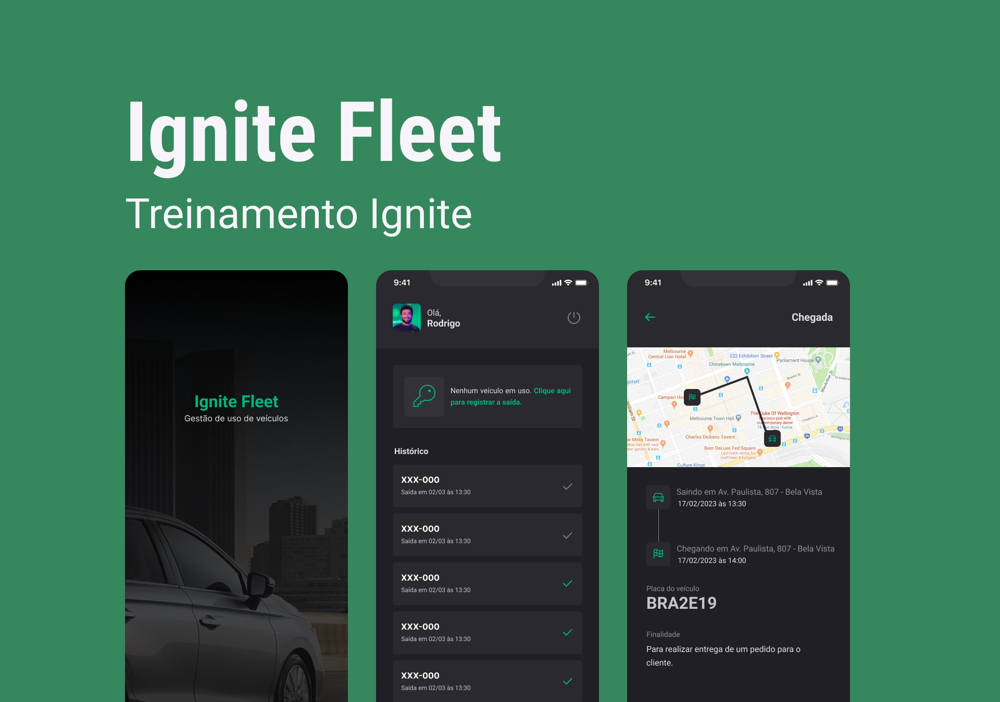

<h1 align="center">
    
</h1>

<p align="center">
  <a href="#-tecnologias">Tecnologias</a>&nbsp;&nbsp;&nbsp;|&nbsp;&nbsp;&nbsp;
  <a href="#-projeto">Projeto</a>&nbsp;&nbsp;&nbsp;|&nbsp;&nbsp;&nbsp;
  <a href="#-layout">Layout</a>&nbsp;&nbsp;&nbsp;|&nbsp;&nbsp;&nbsp;
  <a href="#-funcionalidades">Funcionalidades</a>&nbsp;&nbsp;&nbsp;|&nbsp;&nbsp;&nbsp;
  <a href="#memo-licença">Licença</a>
</p>

<p align="center">
 

  
</p>

<br>

<p align="center">
  
</p>

## Tecnologias

Esse projeto foi desenvolvido com as seguintes tecnologias:

- [React Native](https://facebook.github.io/react-native/)
- [Expo](https://expo.io/)
- [TypeScript](https://www.typescriptlang.org/)
- [Styled Components](https://styled-components.com/)
- [Realm DB](https://realm.io/)
- [Mongo DB Atlas](https://www.mongodb.com/atlas/database)

## 💻 Projeto

O Happy é uma aplicação que conecta pessoas à casas de acolhimento institucional para fazer o dia de muitas crianças mais feliz 💜

## 🔖 Layout

Nos links abaixo você encontra o layout do projeto web e também do mobile. Lembrando que você precisa ter uma conta no [Figma](http://figma.com/) para acessá-lo.

- [Layout Mobile](https://www.figma.com/file/X27FfVxAgy9f5IFa7ONlph/Happy-Mobile)

## Funcionalidades 🚀

Até o momento, levando em consideração o prazo de 2 semanas _(Due: 11/04/2023)_, listamos algumas funcionalidades básicas que devemos entregar. Caso sobre tempo, podemos trabalhar em funcionalidades secundárias, _backlog_.

### Funcionalidades 1.0 (MVP):

- [ ] **Autenticação**

  - Autenticar o usuario usando uma conta google.
  - Buscar informações do usuario como nome e foto de perfil

- [ ] **Visualizar meu ingresso**
      Uma vez que tenha o código localizador do ingresso emitido pelo Sympla, o usuário poderá conectar seu ingresso à sua conta no app e, dessa forma, terá acesso pelo app.

- [ ] **Compartilhar ingresso nas redes sociais**
      Como uma forma de hypar o evento, o usuário poderá gerar uma imagem - _thumbnail_ com sua foto para divulgar nas redes! `#VouNaRSXP! 🚀💜`

### Funcionalidades 2.0:

- [ ] **Autenticação**
- [ ] **Sistema de convites**
  - Desconto p/ convidar
  - Brindes p/ quem mais convidar
- [ ] **Countdown pro evento**
- [ ] **Dados gerais do evento**
  - Localização
  - Data & Hora
- [ ] **FAQ** - (_Frequently Asked Questions / Perguntas Frequentes_)

- [ ] **Feed de notícias**
      Criar algo tipo um Twitter interno para evento. Tal aba será dedicada aos palestrantes ou organizadores para enviar avisos para os membros.

- [ ] **Lista dos palestrantes**

## Executando o projeto

Abaixo seguem as instruções para você executar o projeto na sua máquina.

Comece clonando o repositório e instalando suas dependências:

```sh
git clone https://github.com/markus90souza/IgniteFleetApp

cd IgniteFleetApp

cp .env.example .env

npm install

```

### Mobile

Para executar o app mobile do RS/XP utilizamos o Expo, uma ferramenta incrível da comunidade React Native. Além do Expo, é necessário que você utilize algum emulador local ou um dispositivo físico pra visualizar a aplicação.

> Você pode instalar o Expo e os emuladores seguindo [esse guia](https://react-native.rocketseat.dev/).

Após configurar o ambiente mobile, você pode abrir o emulador e executar o projeto de acordo com a plataforma que estiver utilizando:

```sh
# Caso esteja usando Android
npm run android

# Caso esteja usando iOS
npm run ios

# Caso esteja usando um dispositivo físico
npm start
```

### Extrutura de pastas e arquivos

```plainText
Ignite Fleet
.
.
|-- android                    # Native android files
|-- ios                        # Native ios files
|-- assets                     # Icons and Splash assets
|-- src                        # Source files
│    |-- @types                # Contains all global definitions of types and interfaces
│    |-- assets                # Contains Js bundles assets. e.g: icons, images etc...
|    |-- components            # Components do app
│    |-- libs                  # Arquivos de configuração de bibliotecas
|    |-- routes                # Navegação do app
|    |-- screens               # Telas do app
|    |-- theme                 # Tema de cores/Tamanhos/Fontes
|    |-- utils                 # Arquivo de funções uteis
|- .env-example                # Variaveis de ambiente
|- .eslint.json                # Configurações de lint do app
|- .gitignore                  # Arquivos ignorados pelo git
|- app.json                    # Configurações do app
|- App.tsx                     # Arquivo inicial do nosso app
|- babel.config.js
|- index.js                    # Arquivo principal do app
|- metro.config.js
|- package.json
|- README.md
|- tsconfig.json
```
